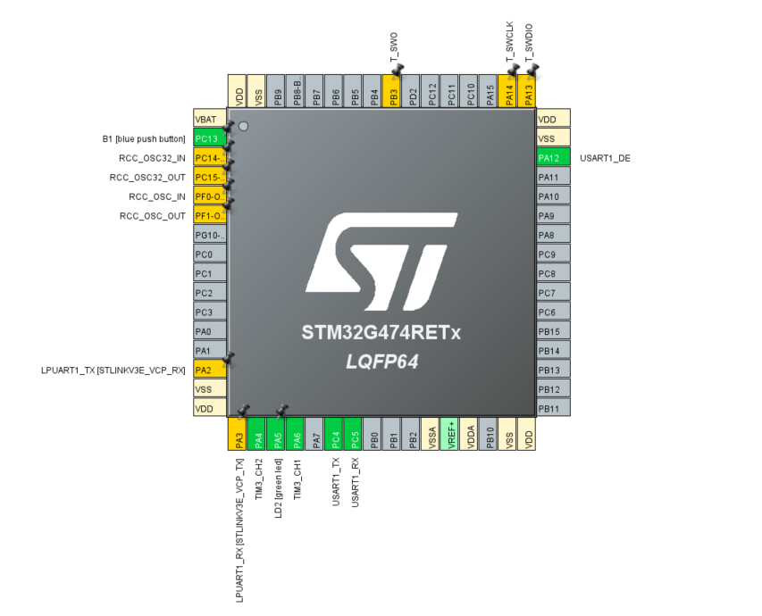
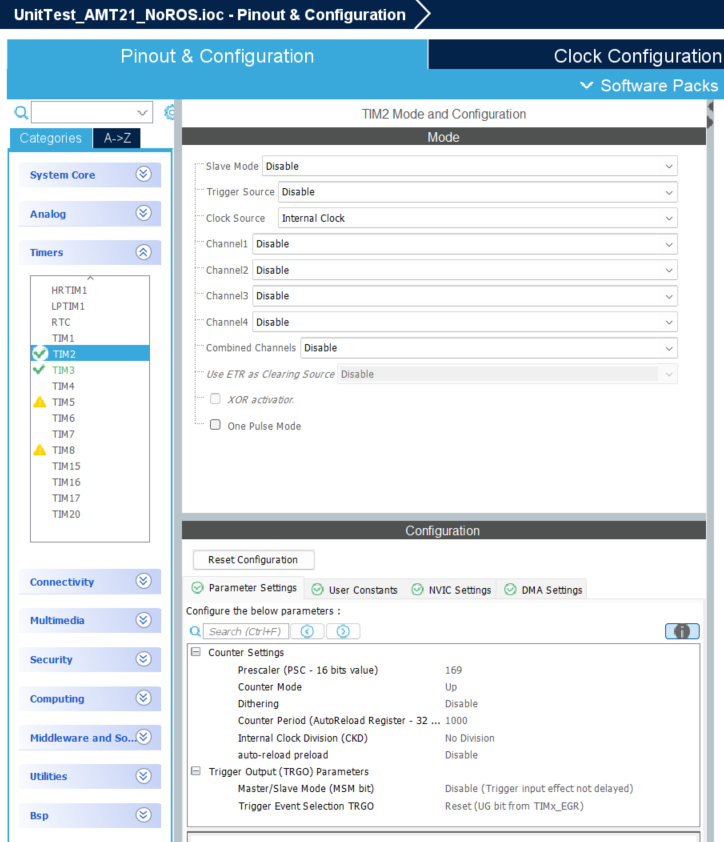
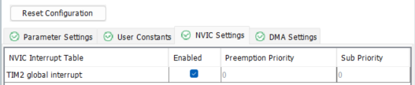
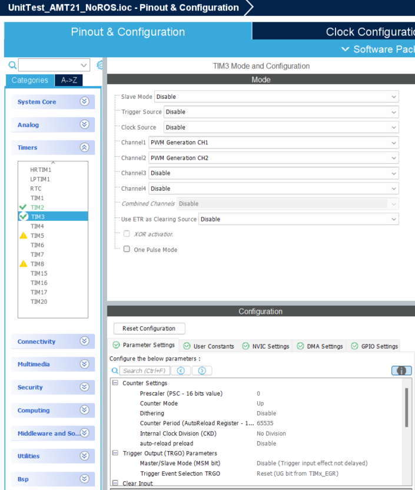
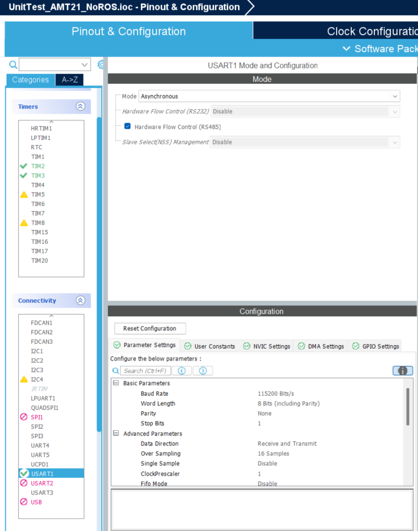
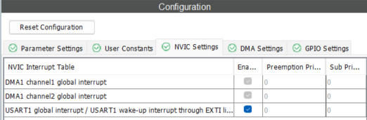
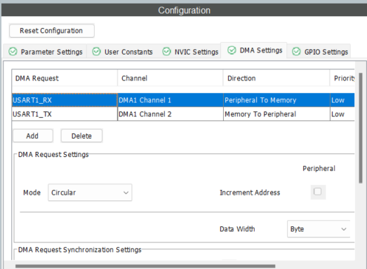
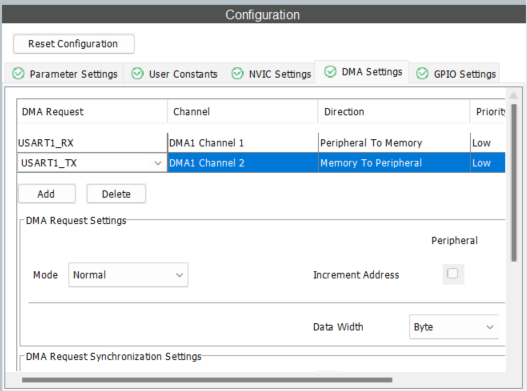

# AMT212E-V with no Micro-ROS
The AMT212E-V is a high-precision absolute encoder with a 12-bit resolution, providing reliable angular position feedback. Its design allows for precise measurement in various applications, particularly where accuracy in positioning and speed control is essential.

## Setting up .ioc



### Timer 2:
 - Enable Internal Clock option for Clock Source
 - Set Prescaler to 169
 - Set Counter Period to 1000
 - Enable TIM2 global interrupt




### Timer 3:
 - Set PWM Generation CH1 for Channel1 of Timer3
 - Set PWM Generation CH2 for Channel2 of Timer3




### UART:
 - Select Asynchronus mode for USART1
 - Enable Hardware Flow Control (RS485)
 - Enable USART1 global interrupt
 - Add USART1_RX and select circular mode
 - Add USART1_TX (normal mode)

 
 
 
 

## Code initiation

To start, download AMT212EV.h, MathOperation.h to your Inc folder and AMT212EV.c, MathOperation.c to your Src folder.

- [AMT212EV.h](Core/Inc/AMT212EV.h)
- [AMT212EV.c](Core/Src/AMT212EV.c)
- [MathOperation.h](Core/Inc/MathOperation.h)
- [MathOperation.c](Core/Src/MathOperation.c)

> In the section `USER CODE BEGIN Includes` add the following line:

```
#include "AMT212EV.h"
```

> Add AMT212EV object in `USER CODE BEGIN PV` section, for example;
```
AMT212EV amt;
```

> Initiate the objact and Timer2 in `USER CODE BEGIN 2`:
```
AMT212EV_Init(&amt, &huart1, 1000, 16384);
HAL_TIM_Base_Start_IT(&htim2);
```

> Add this following line in `USER CODE BEGIN 4`
```
void HAL_TIM_PeriodElapsedCallback(TIM_HandleTypeDef *htim){
	if(htim == &htim2){
		AMT212EV_ReadPosition(&amt);
		AMT212EV_DiffCount(&amt);
		AMT212EV_Compute(&amt);
	}
}
```